# Assignment 3

## Exercise 1

### a. We can try compute the value $S$ at  $N = 9$ by

$S = 1^3 + 2^3 + 3^3 + \dots + N^3 = (1+2+3+ \dots + N)^2 = \left(\frac{N(N+1)}{2}\right)^2$
At $N = 9, S = 2025$

We can conclude that N requires 1 byte and S requires two bytes since maximum value of N is 8 and S is 2025.

### b. Diagram

```mermaid
flowchart TD
    Start --> Input["Enter an integer (1 <= N <= 9)"]
    Input --> Check{Is N between 1 and 9?}
    Check -- Yes --> Init["Set S = 0"]
    Init --> LoopStart["i = 1"]
    LoopStart --> Sum["S += i * i * i"]
    Sum --> Increment["i++"]
    Increment --> Continue{Is i ≤ N?}
    Continue -- Yes --> Sum
    Continue -- No --> Display["Display the result S"]
    Display --> End["End"]
    Check -- No --> Error["Invalid input! Retry."]
    Error --> Input
```



### c. Value of S for each iteration

| Iteration | S    |
| --------- | ---- |
| 0         | 0    |
| 1         | 1    |
| 2         | 9    |
| 3         | 36   |
| 4         | 100  |
| 5         | 225  |
| 6         | 441  |
| 7         | 784  |
| 8         | 1296 |
| 9         | 2025 |

### d. C code

```c
#include <stdio.h>

int main() {
    int N, i;
    int S = 0;

    // Input N
    do {
        printf("Enter an integer (1 <= N <= 9): ");
        scanf("%d", &N);
    } while (N < 1 || N > 9);

    // Calculate S = 1^3 + 2^3 + ... + N^3
    for (i = 1; i <= N; i++) {
        S += i * i * i;
    }

    // Display the result
    printf("Sum of cubes from 1 to %d is: %d\n", N, S);

    return 0;
}
```

### e. Assembly code

```assembly
; Program to calculate the sum of cubes from 1 to N (1 <= N <= 9) using 8086 Assembly

.MODEL SMALL                ; Use small memory model (code < 64KB, data < 64KB)
.STACK 100H                 ; Reserve 256 bytes for stack
.DATA
    N DB ?                  ; Holds the input value (1 <= N <= 9)
    SUM DW 0                ; Stores the sum of cubes result
    MSG1 DB "Enter a number between 1 and 9: $"
    MSG2 DB "Invalid input! Try again.$"
    MSG3 DB "Sum of cubes is: $"
.CODE

MAIN PROC
    MOV AX, @DATA           ; Load data segment address to AX
    MOV DS, AX              ; Initialize data segment register

INPUT:
    LEA DX, MSG1            ; Load address of input prompt message
    MOV AH, 09H             ; Display string function
    INT 21H

    MOV AH, 01H             ; Read character from standard input
    INT 21H
    SUB AL, '0'             ; Convert ASCII character to integer
    MOV BL, AL              ; Store input in BL for validation

    CMP BL, 1               ; Check if input is less than 1
    JB INVALID              ; Jump to INVALID if below valid range
    CMP BL, 9               ; Check if input is greater than 9
    JA INVALID              ; Jump to INVALID if above valid range

    MOV N, BL               ; Store valid input in variable N
    MOV CX, 1               ; Initialize counter to 1
    MOV SUM, 0              ; Initialize sum to 0

LOOP_START:
    MOV AX, CX              ; Move current counter value to AX
    IMUL CX                 ; AX = CX * CX (square)
    IMUL CX                 ; AX = CX * CX * CX (cube)
    ADD SUM, AX             ; Add the cube to the running total
    INC CX                  ; Increment counter for next iteration

    MOV AL, N               ; Load the input value N into AL
    MOV AH, 0               ; Reset AH
    CMP CX, AX              ; Compare counter with input N
    JG DISPLAY              ; If CX > N, jump to DISPLAY result
    JMP LOOP_START          ; Repeat the loop

INVALID:
    LEA DX, MSG2            ; Load address of error message
    MOV AH, 09H             ; Display string function
    INT 21H
    JMP INPUT               ; Prompt input again

DISPLAY:
    LEA DX, MSG3            ; Load address of result message
    MOV AH, 09H             ; Display string function
    INT 21H

    MOV AX, SUM             ; Load the calculated sum into AX
    CALL PRINT_NUM          ; Call subroutine to print the result

    MOV AH, 4CH             ; DOS terminate program function
    INT 21H

MAIN ENDP

PRINT_NUM PROC               ; Subroutine to print a number in decimal format
    MOV BX, 10              ; Divisor for decimal system
    XOR CX, CX              ; Clear CX to count digits

NEXT_DIGIT:
    XOR DX, DX              ; Clear DX for accurate division
    DIV BX                  ; Divide AX by 10, quotient in AX, remainder in DX
    PUSH DX                 ; Push remainder (last digit) onto stack
    INC CX                  ; Increment digit counter
    CMP AX, 0               ; Check if quotient is zero
    JNE NEXT_DIGIT          ; Repeat until all digits are processed

PRINT_LOOP:
    POP DX                  ; Pop last digit from the stack
    ADD DL, '0'             ; Convert to ASCII by adding '0'
    MOV AH, 02H             ; Display character function
    INT 21H
    LOOP PRINT_LOOP         ; Repeat for all digits
    RET
PRINT_NUM ENDP

END MAIN

```

f. Check S in each loop value:


As we can see. Value of S satisfies the table above.

Running code screen:


## Exercise 2

a. Diagram:

```
flowchart TD
    A[Start] --> B[Save string to stack]
    B --> C[Skip first two bytes (size, count)]
    C --> D[Take byte, subtract 48]
    D --> E[Add to AL/AX]
    E --> F{Is end of string?}
    F -- No --> C
    F -- Yes --> G[Return result in AX]
    G --> H[End]
```

b. Assembly code:

```assembly
; 8086 Assembly code to calculate the sum of digits in a character array (string)
; The string is passed through the stack, and the result is returned in AX.

.MODEL SMALL
.STACK 100H
.DATA
    PROMPT DB "Enter a string of digits: $"
    RESULT_MSG DB "Sum of digits is: $"
    INPUT_BUFFER DB 20, ?, 20 DUP('$')
.CODE

MAIN PROC
    MOV AX, @DATA
    MOV DS, AX

    ; Display prompt message
    LEA DX, PROMPT
    MOV AH, 09H
    INT 21H

    ; Read string from user
    MOV AH, 0AH
    LEA DX, INPUT_BUFFER
    INT 21H

    ; Push address of the input string onto the stack
    LEA SI, INPUT_BUFFER + 2  ; Skip the first 2 bytes (size and count)
    PUSH SI
    CALL SUM_OF_DIGITS

    ; Display result message
    LEA DX, RESULT_MSG
    MOV AH, 09H
    INT 21H

    ; Print the result
    CALL PRINT_NUM

    ; End program
    MOV AH, 4CH
    INT 21H
MAIN ENDP

; Subroutine to calculate the sum of digits
SUM_OF_DIGITS PROC
    PUSH BP
    MOV BP, SP

    MOV SI, [BP + 4]    ; Get the address of the input string from the stack
    XOR AX, AX          ; Initialize sum to 0

SUM_LOOP:
    MOV BL, [SI]        ; Read the character
    CMP BL, 0           ; Check for string terminator (null)
    JE SUM_END          ; If null, end the loop

    CMP BL, '0'         ; Validate if it's a digit
    JB NOT_A_DIGIT
    CMP BL, '9'
    JA NOT_A_DIGIT

    SUB BL, '0'         ; Convert ASCII to integer
    ADD AX, BX          ; Add to sum

NOT_A_DIGIT:
    INC SI              ; Move to the next character
    JMP SUM_LOOP

SUM_END:
    POP BP
    RET
SUM_OF_DIGITS ENDP

; Subroutine to print the result (AX)
PRINT_NUM PROC
    MOV BX, 10          ; Divisor for decimal conversion
    XOR CX, CX          ; Clear digit counter

CONVERT_LOOP:
    XOR DX, DX
    DIV BX              ; AX = AX / 10, remainder in DX
    PUSH DX             ; Save remainder (digit)
    INC CX              ; Increment digit count
    CMP AX, 0
    JNE CONVERT_LOOP

PRINT_LOOP:
    POP DX
    ADD DL, '0'         ; Convert to ASCII
    MOV AH, 02H         ; Print character function
    INT 21H
    LOOP PRINT_LOOP
    RET
PRINT_NUM ENDP

END MAIN

```