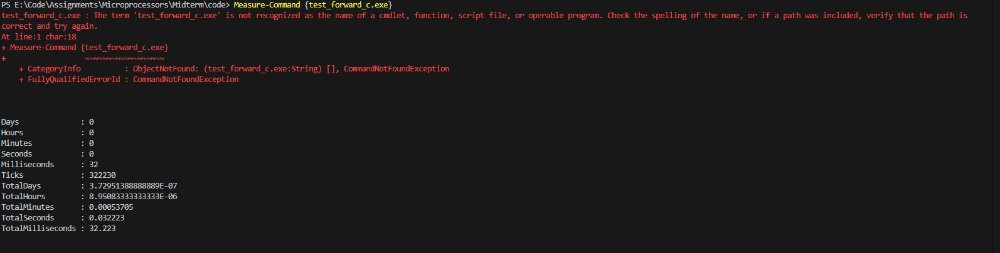
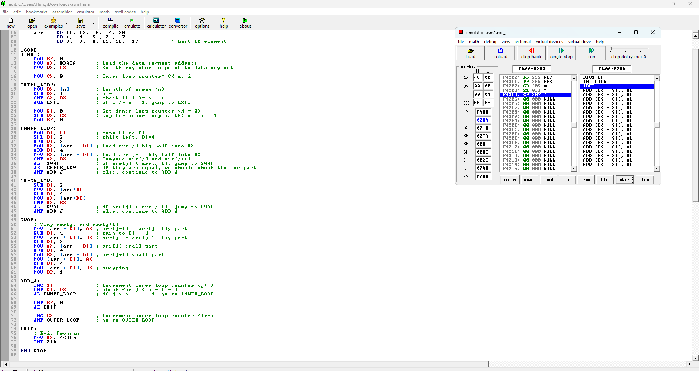

# Microprocessor Midterm 

Nguyen Duc Hung - 20233960 - 157326
All code and executables are in the Code folder.
Diagrams are in the Diagrams folder.

## Question 1

- Decoding the JMP SHORT lbl instruction: The JMP SHORT lbl instruction is an unconditional jump to the label lbl within a short distance.

- The "SHORT" modifier indicates that the jump is a short jump, meaning it is within a range of -128 to +127 bytes from the current instruction.

- Breakdown of the JMP SHORT instruction:
Instruction Code: The machine code for JMP SHORT lbl will look like this in hexadecimal:

- The first byte will be the opcode for JMP SHORT, which is EB (in hexadecimal).

- The second byte represents the relative offset (in bytes) from the next instruction to the target address lbl.

- The full instruction can be represented as: ```EB <relative offset>```

- Byte Structure:

  - The first byte (EB) is the opcode for the JMP SHORT instruction.

  - The second byte is the signed relative offset (in 2's complement format) to the label lbl. This byte specifies how far the jump is from the next instruction.

  - The relative offset is calculated by the difference between the address of the lbl and the address of the next instruction (after JMP SHORT). The next instruction is the ADD AX, BX, which is 3 bytes long. So the relative offset is the distance between the address of lbl and the address of the instruction immediately following the JMP instruction.

- Relationship between the second byte and the IP (Instruction Pointer):
The IP register holds the offset of the currently executing instruction relative to the start of the segment. After executing a jump, the IP is updated to point to the destination address of the jump. When the JMP SHORT lbl instruction is executed, the IP register will be modified by the relative offset specified in the second byte of the instruction.

- For example, if the second byte of the instruction is 0x05, the jump will occur 5 bytes ahead (relative to the next instruction).

- If the second byte is 0xFF, the jump will occur 255 bytes backwards, as the second byte is signed (2's complement).

- The second byte represents the distance to the target address, and this distance is added to the current value of IP (pointing to the instruction after JMP) to determine where execution should continue.

## Question 2

- Bubble Sort is a simple comparison-based sorting algorithm. It works by repeatedly stepping through a list of items, comparing adjacent elements, and swapping them if they are in the wrong order. The process is repeated until the list is sorted.

- For example:

  - Start at the beginning of the list.
  - Compare each pair of adjacent elements.
  - If the first is greater than the second, swap them.
  - After the first pass, the largest element will have "bubbled up" to the correct position (the end of the list).
  - Repeat the process for the remaining unsorted elements (ignoring the last sorted element).
  - Keep doing this until no swaps are needed, which means the list is sorted.

1. There are two approaches to Bubble Sort: You can either loop from back to front or front to back

- Algorithm Flowchart: Bubble Sort in decreasing order.
  - Alg1: Looping from front to back.
  
  
  - Alg2: Looping from back to front.
  
  

2. C Code:

- C1:

    ```c
    #include <stdio.h>


    int main()
    {
        // Test
        int n = 100;
        short int arr[100] = {
        27, -5, 43, 35, -50, 14, -13, 42, -18, 9,
        -35, 31, -48, 21, 46, -21, -44, -7, 11, 49,
        33, -27, -3, -8, -42, 17, 7, -25, 10, 26,
        45, -10, 29, -36, 6, -17, -30, -33, -6, 2,
        -1, 34, 3, -26, 20, 13, -19, -12, 24, -22,
        -2, 4, -32, 23, -29, 8, 12, 48, -16, -31,
        38, 32, 16, 50, -40, 19, -15, 41, -4, -39,
        5, -14, -24, -28, -9, 1, 37, 15, -23, -49,
        36, 18, -11, 40, -38, 47, -37, -46, 39, 25,
        -45, -41, -47, -20, 22, -6, 28, -34, 30, 44};

        
        for (int i = 0; i < n-1; i++)
            for (int j = 0; j < n - 1 - i; j++)
            {
                if (arr[j] < arr[j+1])
                {
                    int temp = arr[j];
                    arr[j] = arr[j+1];
                    arr[j+1] = temp;
                }
            }
    }
    ```

- C2:

  ```c
    #include <stdio.h>


    int main()
    {
        // Test
        int n = 100;
        short int arr[100] = {
            27, -5, 43, 35, -50, 14, -13, 42, -18, 9,
            -35, 31, -48, 21, 46, -21, -44, -7, 11, 49,
            33, -27, -3, -8, -42, 17, 7, -25, 10, 26,
            45, -10, 29, -36, 6, -17, -30, -33, -6, 2,
            -1, 34, 3, -26, 20, 13, -19, -12, 24, -22,
            -2, 4, -32, 23, -29, 8, 12, 48, -16, -31,
            38, 32, 16, 50, -40, 19, -15, 41, -4, -39,
            5, -14, -24, -28, -9, 1, 37, 15, -23, -49,
            36, 18, -11, 40, -38, 47, -37, -46, 39, 25,
            -45, -41, -47, -20, 22, -6, 28, -34, 30, 44};

        
        for (int i = n - 1; i > 0; i--)
            for (int j = n - 1; j > n - i - 1; j--)
            {
                if (arr[j] > arr[j-1])
                {
                    int temp = arr[j];
                    arr[j] = arr[j-1];
                    arr[j-1] = temp;
                }
            }
    }
  ```

- Compare:

  - The two code having the same length.
  - Their performance is relatively equivalent
  - Execution file size: Equivalent (127 Kb)
  
- Testing environment:
  - CPU: Intel Core i5-1135G7: 4 Cores, 8 Threads, 4.20 GHz Turbo
    - Cache: Cache L1:96 KB (per core), L2:1.25 MB (per core), L3:8 MB (shared)
  - RAM: 16Gb DDR4 3200Mhz Single Channel
  - Operating System: Microsoft Windows 11 Pro, Version: 10.0.22631 N/A Build 22631
  - C Code compiled by gcc.exe (Rev2, Built by MSYS2 project) 14.2.0

- Testing procedure:
  - Compile code 
  - Use PowerShell: Measure-Command { your_program.exe }
  - Since time is not uniform between measurements because of CPU background tasks...I measured each program 5 times. Units are in miliseconds.

| Trial   | C2      | C1      |
| ------- | ------- | ------- |
| 1       | 48.3256 | 46.8938 |
| 2       | 35.2994 | 32.1546 |
| 3       | 32.8177 | 32.223  |
| 4       | 32.3293 | 33.8003 |
| 5       | 34.9737 | 32.0648 |
| Average | 36.7491 | 35.4273 |


1. Assembly Code:

- asm1:

  ```assembly
      .MODEL SMALL:
      .STACK 300h:

      .DATA:
          n      DW 100              ; Length of the array (5)
          arr    DW 27, -5, 43, 35, -50, 14, -13, 42, -18, 9,           ; First 10 elements
                DW -35, 31, -48, 21, 46, -21, -44, -7, 11, 49,          ; Next 10 elements
                DW 33, -27, -3, -8, -42, 17, 7, -25, 10, 26,            ; Next 10 elements
                DW 45, -10, 29, -36, 6, -17, -30, -33, -6, 2,            ; Next 10 elements
                DW -1, 34, 3, -26, 20, 13, -19, -12, 24, -22,            ; Next 10 elements
                DW -2, 4, -32, 23, -29, 8, 12, 48, -16, -31,             ; Next 10 elements
                DW 38, 32, 16, 50, -40, 19, -15, 41, -4, -39,             ; Next 10 elements
                DW 5, -14, -24, -28, -9, 1, 37, 15, -23, -49,             ; Next 10 elements
                DW 36, 18, -11, 40, -38, 47, -37, -46, 39, 25,            ; Next 10 elements
                DW -45, -41, -47, -20, 22, -6, 28, -34, 30, 44            ; Last 10 element

      .CODE:
      START:
          MOV AX, @DATA      ; Load the data segment address
          MOV DS, AX         ; Set DS register to point to data segment

          MOV CX, 0          ; Outer loop counter: CX as i

      OUTER_LOOP:
          MOV DX, [n]        ; Length of array (n)
          SUB DX, 1          ; n - 1
          CMP CX, DX         ; check if i >= n - 1
          JGE EXIT           ; if i >= n - 1, jump to EXIT
          
          MOV SI, 0          ; Set inner loop counter (j = 0)
          SUB DX, CX         ; cap for inner loop is DX; n - i - 1
        
      INNER_LOOP:
          MOV DI, SI         ; copy SI to DI
          SHL DI, 1          ; shift left, DI*2
          MOV AX, [arr + DI] ; Load arr[j] into AX
          ADD DI, 2
          MOV BX, [arr + DI] ; Load arr[j+1] into BX
          CMP AX, BX         ; Compare arr[j] and arr[j+1]
          JL  SWAP           ; if arr[j] < arr[j+1], jump to SWAP
          JMP ADD_J          ; else, continue to ADD_J
          
      SWAP:
          ; Swap arr[j] and arr[j+1]
          MOV [arr + DI], AX ; arr[j+1] = arr[j]
          SUB DI, 2          ; turn to DI - 2
          MOV [arr + DI], BX ; arr[j] = arr[j+1]
          
      ADD_J:
          INC SI             ; Increment inner loop counter (j++)
          CMP SI, DX         ; check for j < n - 1 - i
          JL INNER_LOOP      ; if j < n - 1 - i, go to INNER_LOOP
          
          INC CX             ; Increment outer loop counter (i++)
          JMP OUTER_LOOP     ; go to OUTER_LOOP

      EXIT:
          ; Exit Program
          MOV AX, 4C00h
          INT 21h
  ```

- asm2:

  ```assembly
    .MODEL SMALL
    .STACK 300h

    .DATA
        n      DW 100              ; Length of the array (5)
        arr    DW 27, -5, 43, 35, -50, 14, -13, 42, -18, 9,           ; First 10 elements
              DW -35, 31, -48, 21, 46, -21, -44, -7, 11, 49,          ; Next 10 elements
              DW 33, -27, -3, -8, -42, 17, 7, -25, 10, 26,            ; Next 10 elements
              DW 45, -10, 29, -36, 6, -17, -30, -33, -6, 2,            ; Next 10 elements
              DW -1, 34, 3, -26, 20, 13, -19, -12, 24, -22,            ; Next 10 elements
              DW -2, 4, -32, 23, -29, 8, 12, 48, -16, -31,             ; Next 10 elements
              DW 38, 32, 16, 50, -40, 19, -15, 41, -4, -39,             ; Next 10 elements
              DW 5, -14, -24, -28, -9, 1, 37, 15, -23, -49,             ; Next 10 elements
              DW 36, 18, -11, 40, -38, 47, -37, -46, 39, 25,            ; Next 10 elements
              DW -45, -41, -47, -20, 22, -6, 28, -34, 30, 44            ; Last 10 element

    .CODE
    START:
        MOV AX, @DATA      ; Load the data segment address
        MOV DS, AX         ; Set DS register to point to data segment

        MOV CX, [n]          ; Outer loop counter: CX as i
        DEC CX               ; int i = n - 1, initial value of i

    OUTER_LOOP:
        MOV DX, [n]        ; Length of array (n)
        SUB DX, 1          ; n - 1
        CMP CX, 0         ; check if i > 0
        JLE EXIT           ; if i <= 0, jump to EXIT

        MOV SI, DX          ; Set inner loop counter (j = n - 1)
        SUB DX, CX         ; cap for inner loop is DX; n - i - 1
      
    INNER_LOOP:
        MOV DI, SI         ; copy SI to DI
        SHL DI, 1          ; shift left, DI*2
        MOV AX, [arr + DI] ; Load arr[j] into AX
        SUB DI, 2
        MOV BX, [arr + DI] ; Load arr[j-1] into BX
        CMP AX, BX         ; Compare arr[j] and arr[j-1]
        JG  SWAP           ; if arr[j] > arr[j-1], jump to SWAP
        JMP SUB_J          ; else, continue to SUB_J

    SWAP:
        ; Swap arr[j] and arr[j+1]
        MOV [arr + DI], AX ; arr[j-1] = arr[j]
        ADD DI, 2          ; turn to DI+ 2
        MOV [arr + DI], BX ; arr[j] = arr[j-1]

    SUB_J:
        DEC SI             ; Decreament inner loop counter (j--)
        CMP SI, DX         ; check for j > n - 1 - i
        JG INNER_LOOP      ; if j > n - 1 - i, go to INNER_LOOP

        DEC CX             ; Decreament outer loop counter (i--)
        JMP OUTER_LOOP     ; go to OUTER_LOOP

    EXIT:
        ; Exit Program
        MOV AX, 4C00h
        INT 21h

    END START
  ```

- Compare:

  - The two code having the same length.
  - Their performance is relatively equivalent.
  - Execution file size: asm1: 1553 bytes,  asm2: 1555 bytes

- Testing environment:
  - emu8086

- Testing procedure:
  - Compile code 
  - Since time is not uniform between measurements because of CPU background tasks...I measured each program 5 times. Units are in seconds.
  - Since sorting array length 100 can take 5-6 minutes, reduce to length 15 helps.

| Trial   | asm2 | asm1 |
| ------- | ---- | ---- |
| 1       | 10   | 11   |
| 2       | 9    | 9    |
| 3       | 11   | 10   |
| 4       | 8    | 11   |
| 5       | 10   | 8    |
| Average | 9.6  | 9.8  |

5. I choose code asm1 to improve on:

- asm3:

 ```assembly
  .MODEL SMALL
  .STACK 300h

  .DATA
      n      DW 15              ; Length of the array (5)
      arr    DW 10, 12, 15, 14, 20
            DW 1,  4 , 5 , 2 ,  7
            DW 3,  9,  8, 11, 16,  19          ; Last 10 element
  .CODE
  START:
      MOV BP, 0          ; load the flag
      MOV AX, @DATA      ; Load the data segment address
      MOV DS, AX         ; Set DS register to point to data segment

      MOV CX, 0          ; Outer loop counter: CX as i

  OUTER_LOOP:
      MOV DX, [n]        ; Length of array (n)
      SUB DX, 1          ; n - 1
      CMP CX, DX         ; Check if i >= n - 1
      JGE EXIT           ; If i >= n - 1, jump to EXIT
      
      MOV SI, 0          ; Set inner loop counter (j = 0)
      SUB DX, CX         ; Cap for inner loop is DX; n - i - 1
      
      MOV BP, 0        ; Flag to detect if any swap occurred

  INNER_LOOP:
      MOV DI, SI         ; Copy SI to DI
      MOV AX, [arr + DI*2] ; Load arr[j] into AX
      MOV BX, [arr + DI*2 + 2] ; Load arr[j+1] into BX
      CMP AX, BX         ; Compare arr[j] and arr[j+1]
      JL  SWAP           ; If arr[j] < arr[j+1], jump to SWAP
      
      JMP ADD_J          ; Else, continue to ADD_J
      
  SWAP:
      ; Swap arr[j] and arr[j+1]
      MOV [arr + DI*2 + 2], AX ; arr[j+1] = arr[j]
      MOV [arr + DI*2], BX     ; arr[j] = arr[j+1]
      MOV BP, 1        ; Set flag indicating a swap occurred

  ADD_J:
      INC SI             ; Increment inner loop counter (j++)
      CMP SI, DX         ; Check for j < n - 1 - i
      JL INNER_LOOP      ; If j < n - 1 - i, go to INNER_LOOP
      
      ; If no swaps occurred, array is already sorted, exit early
      CMP BP, 0
      JE  EXIT           ; If no swaps, exit the loop
      
      INC CX             ; Increment outer loop counter (i++)
      JMP OUTER_LOOP     ; Go to OUTER_LOOP

  EXIT:
      ; Exit Program
      MOV AX, 4C00h
      INT 21h

  END START
 ```

- Improvements:

  - Length increase by four, small.
  - Optimized Indexing: Directly multiply SI by 2 when accessing the array (e.g., MOV AX, [arr + DI*2]).
  - Swap Flag: Added a FLAG in BP to track if any swaps were made during an inner loop. If no swaps are made in an entire pass, the array is already sorted, so the program exits early. This prevents unnecessary loops after the array is sorted.
  - Efficient Loop Structure: Removed unnecessary JMP instructions by directly using the JL and JGE instructions for controlling flow.
  
6. Benchmarks

- Smaller execution file size: 1395 bytes.
- A lot faster:

| Trial   | asm2 | asm1 | asm3 |
| ------- | ---- | ---- | ---- |
| 1       | 10   | 11   | 3    |
| 2       | 9    | 9    | 3    |
| 3       | 11   | 10   | 4    |
| 4       | 8    | 11   | 2    |
| 5       | 10   | 8    | 3    |
| Average | 9.6  | 9.8  | 3    |

7. Code for 4-byte words.

```assembly
    .MODEL SMALL
    .STACK 300h

    .DATA
        n      DW 15              ; Length of the array (5)
        arr    DD 10, 12, 15, 14, 20
              DD 1,  4 , 5 , 2 ,  7
              DD 3,  9,  8, 11, 16,  19          ; Last 10 element

    .CODE
    START:
        MOV BP, 0
        MOV AX, @DATA      ; Load the data segment address
        MOV DS, AX         ; Set DS register to point to data segment

        MOV CX, 0          ; Outer loop counter: CX as i

    OUTER_LOOP:
        MOV DX, [n]        ; Length of array (n)
        SUB DX, 1          ; n - 1
        CMP CX, DX         ; check if i >= n - 1
        JGE EXIT           ; if i >= n - 1, jump to EXIT
        
        MOV SI, 0          ; Set inner loop counter (j = 0)
        SUB DX, CX         ; cap for inner loop is DX; n - i - 1
        MOV BP, 0
      
    INNER_LOOP:
        MOV DI, SI         ; copy SI to DI
        SHL DI, 2          ; shift left, DI*4
        ADD DI, 2          
        MOV AX, [arr + DI] ; Load arr[j] big half into AX
        ADD DI, 4
        MOV BX, [arr + DI] ; Load arr[j+1] big half into BX
        CMP AX, BX         ; Compare arr[j] and arr[j+1]
        JL  SWAP           ; if arr[j] < arr[j+1], jump to SWAP
        JE  CHECK_LOW      ; if they are equal, we should check the low part
        JMP ADD_J          ; else, continue to ADD_J

    CHECK_LOW:
        SUB DI, 2
        MOV BX, [arr+DI]
        SUB DI, 4
        MOV AX, [arr+DI]
        CMP AX, BX
        JL  SWAP           ; if arr[j] < arr[j+1], jump to SWAP
        JMP ADD_J          ; else, continue to ADD_J
        
    SWAP:
        ; Swap arr[j] and arr[j+1]
        MOV [arr + DI], AX ; arr[j+1] = arr[j] big part
        SUB DI, 4          ; turn to DI - 4
        MOV [arr + DI], BX ; arr[j] = arr[j+1] big part
        SUB DI, 2
        MOV AX, [arr + DI] ; arr[j] small part
        ADD DI, 4
        MOV BX, [arr + DI] ; arr[j+1] small part
        MOV [arr + DI], AX
        SUB DI, 4
        MOV [arr + DI], BX ; swapping
        MOV BP, 1
        
    ADD_J:
        INC SI             ; Increment inner loop counter (j++)
        CMP SI, DX         ; check for j < n - 1 - i
        JL INNER_LOOP      ; if j < n - 1 - i, go to INNER_LOOP
        
        CMP BP, 0
        JE EXIT
        
        INC CX             ; Increment outer loop counter (i++)
        JMP OUTER_LOOP     ; go to OUTER_LOOP

    EXIT:
        ; Exit Program
        MOV AX, 4C00h
        INT 21h

    END START
```
Images of code running:

Benchmarking C code:


Running Assembly code:
